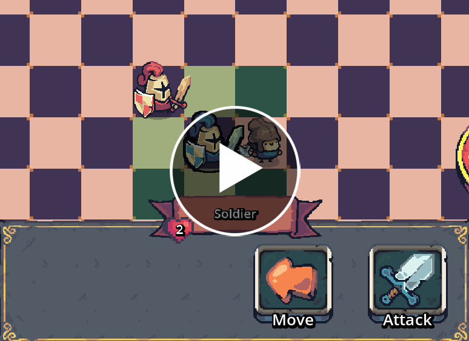

# 🎮✨ A Kid's Dream — Turn-based Tactics War Game

A Kid’s Dream is a **turn‑based tactical** war game where players take turns **commanding diverse units** (to be added 🤫) with unique abilities to fight epic battles.

  

---

## 📖 Table of Contents

- [Why “A Kid’s Dream”?](#-why-a-kids-dream)
- [Play the Build](#-play-the-build)
- [Features](#-features)
- [Roadmap](#-roadmap)
- [How to Play](#-how-to-play-quick)
- [Developer Console Commands](#️-developer-console-commands)
- [Documentation](#-documentation)
- [How It Works](#-how-it-works)
- [Contributing](#-contributing)
- [License](#-license)
- [AI Usage](#-ai-usage)
- [Credits](#-credits)

---
## 🤔 Why “A Kid’s Dream”?

When I was a child, I created a small board game using paper and scissors. It was simple, but incredibly fun to play.

**A Kid’s Dream** is my attempt to recreate that experience — not exactly as it was, but from the pieces that remain in my memory. It is a game inspired by childhood imagination, handmade rules, and the joy of turning simple ideas into an adventure.

## 🚀 Play the build

> [!TIP]
> To spawn units for testing, see the [Developer Console Commands](#️-developer-console-commands) section.

We attach exported builds to the [GitHub Release](https://github.com/MrCode200/AKidsDream/releases), these can be run without needing to install godot.

To run locally with the project files:

1. Install Godot 4.7.x.
2. Clone this repository:

   git clone https://github.com/MrCode200/AKidsDream.git
   cd AKidsDream

3. Install [Dotnet 8.0](https://dotnet.microsoft.com/en-us/download/dotnet/8.0)
4. Press Play to run the game, or use the Editor export templates to create platform-specific builds.

## 🌟 Features

- 🎯 Turn-based tactical combat on a tile grid
- 🧩 Modular unit system (stats, abilities, components)
- 💾 Save/load and Serilog structured logging

## 🛣️ Roadmap

- [ ] 🤖 Add Enemy AI Logic
- [ ] 👀 More unique Units
- [ ] 💎 Mana System and Upgrades
- [ ] 🌐 Online matchmaking

## 🎮 How to play (quick)

- Left click — select units and interact with tiles
- End Turn — finish your turn
- `~` (tilde) — open developer console for debug/test commands

Short loop: select a unit → move → use ability → end turn. Win by (... maybe you can tell me how to win ?:0 (looking for suggestions :)))

## 🛠️ Developer console commands

- `unit_create <name> <player_id> <team_id> <x> <y>` — spawn a unit at (x,y)
> [!NOTE]
> Available Units: Soldier, TestUnit
>
> (currently only 1 1, or 2 2 work for player_id and team_id. ex: unit_create 1 1 2 4)

## 📃 Documentation
View the project structure as well as roadmap in [miro](https://miro.com/app/board/uXjVH4avfyE=/?share_link_id=420032532025).

Or ask an AI directly for precise questions with [devin](https://app.devin.ai/org/navidyaghmaei/wiki/MrCode200/AKidsDream/page/1?branch=main)

## 🤔 How it works

A Kid's Dream is built around a *modular & data-driven* architecture.
- `Units` which are built from `components`
- `Abilities` which are built from `Effects`
- `Paylaods&States` which allow Abilities to talk to each other 

### Abilities
The new system introduces two ways of running abilities:

> ⛓️Sequential
> Runs all selected *tiles* one by one, and casts the effect

> 📦Batch
> Runs the effect on all selected tiles.

Each Abilitie can contain *multiple* Effects, and each Effect (damage/moveself/...),
contains triggers, on which frame of an animation or time to be cast.

This system is built to be as modular as possible increasing devspeed when implementing new units.
(I have learned the hard way that to `rebuild systems is hard ～(　TロT)σ`, so I tried to built a `future proof system`)

## 🙌 Contributing

Contributions are very welcome:)! Open issues or PRs. Use conventional commits.
If anyone is interested in ***Joining the project***, also always welcome`( •̀ ω •́ )✧`

## 📜 License

This project uses the AKidsDream Non-Commercial License. See `LICENSE` for full details. Contact the maintainer for commercial licensing inquiries.

## 🤖 AI Usage

AI tools were used only as development assistance. They helped with debugging, troubleshooting, and providing suggestions for the design and implementation of individual systems.

AI was also used to help write and improve documentation. All final implementation decisions, code integration, and project direction were reviewed and made by the developer.

## ✨ Credits

- Author: MrCode200
- Thanks to the helpful members of the Godot Discord community who helped me solve problems during development
- Built with Godot 4 and C#

---

Made with ❤️ using Godot 4 &amp; C#

