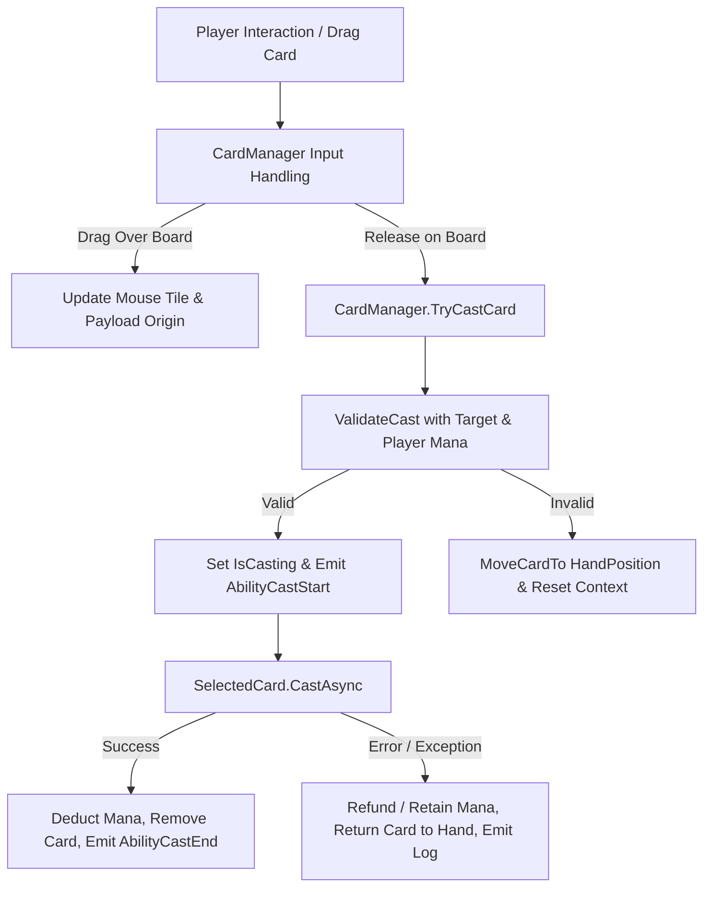

Now I'm searching all files with "Ability" in their names to identify key components related to abilities, so I can understand how abilities are structured and managed in the code.

**Requirements**

**Overview & Goals**  
Review, verify, and resolve logic bugs and architectural inconsistencies in the card system and ability casting framework across `CardManager`, `AbilityCard`, `AbilityData`, `PlayerHand`, and `CardCaster`.

**Scope**
- **In Scope**:
  - Ability casting execution flow for cards vs units.
  - Cost check, reach validation, and payload processing in `AbilityData` and `AbilityCard`.
  - Card input handling (clicking, dragging, dropping, hovering), selection state, hand management, and visual feedback.
  - Resource deduction and error recovery when ability execution fails.
- **Out of Scope**:
  - Rewriting unit AI controllers.
  - Adding new card types or board generation rules.

**Identified Issues & Verification Summary**

**1. Ability Casting**
- [x] ~~**Premature Resource Deduction & Lack of Rollback**: In `CardManager.TryCastCard()`, `castingPlayer.Mana` is deducted *before* `await SelectedCard.CastAsync()`. If casting fails (e.g. `ErrorResult` returned or exception thrown), mana is lost and the card is still removed from `PlayerHand` and freed.~~
- [ ] **Async Race Condition**: `TryCastCard()` is `async void`. If the player interacts with another card while the async cast is awaiting animation/trigger completion, `SelectedCard` changes. `var castCard = SelectedCard` after `await` destroys the newly selected card instead of the cast card.
- [ ] **Missing EventBus Signals**: Unlike `AbilityComponent.CastAsync()`, `CardManager` / `AbilityCard` cast flow does not emit `AbilityCastStart`, `AbilityCostUpdated`, or `AbilityCastEnd` events on `EventBus`, breaking UI synchronization.
- [X] ~~**`CardCaster` Trigger Compatibility**: `CardCaster` has `AnimComp = null`, which causes frame-based animation triggers (`CastOnFrame`, `CastOnLoop`, etc.) to fail or log warnings without graceful fallback.~~

**2. Checking & Validating**
- [ ] **Invalid Reach Origin for Cards**: `CardCaster.TileLocation` is initialized to `(-1, -1)`. In `CardManager`, `_cachedAbilityPayload.CurrentOrigin` is never updated during mouse move. Any card with an `AccessFieldPattern` that is not `AllTilesPattern` (e.g. `AdjacentPattern`, `OneTilePattern`) evaluates reach relative to `(-1, -1)` and fails validation.
> // TODO: make GetUnfilteredTiles and check for if reach -1 -1 (ergo none) to be ignored thus
- [ ] **Sequential Reach Validation Logic**: In `AbilityData.ValidateCast()`, `isFirst` is only true for the first effect in `Effects[]`. Subsequent effects skip reachability verification during sequential payload updates.

**3. Card Management**
- **Input Block on Card Release / Drag**: `CardManager._Input()` immediately returns if `GetViewport().GuiGetHoveredControl()` is not an `AbilityCard`. When releasing or dragging the card over the board, the hovered control is no longer the `AbilityCard`, causing `IsActionReleased` to never trigger `TryCastCard()`.
- **Missing `IsSelected` Assignment**: In `CardManager.SelectCard()`, `clickedCard.IsSelected = true` is never assigned.
- **Incomplete Card Switch in `ChangeCard`**: `ChangeCard()` sets selection flags but does not call `BuildAbilityContextPayload()` or refresh `AbilityVisualizer.ShowReachVisualization`.
- **Card Data Unbound in `PlayerHand.DrawCards`**: `PlayerHand.DrawCards()` calls `newCard.DisplayCard(CardData)` but does not assign `newCard.CardData = CardData`. If `CardData` is not predefined on the prefab instance, accessing `newCard.CardData` triggers `NullReferenceException`.
- **Context Loss on Drag Cancel**: When dragging ends without casting, `ClearAbilityContextPayload()` sets `_cachedAbilityContext = null`, leaving the card selected but unusable until re-clicked.

**Technical Design**

**Current vs Proposed Architecture**

**Current Data Flow & Breakdown Points**
1. `_Input` checks `GuiGetHoveredControl() is AbilityCard` -> **Fails when releasing over game board**.
2. `CardCaster.TileLocation = (-1, -1)` -> **Fails non-global reach patterns during `ValidateCast`**.
3. `TryCastCard` deducts `Mana` -> **Fails to refund if `CastAsync` errors out**.
4. `PlayerHand.DrawCards` instantiates `AbilityCard` -> **Fails to set `newCard.CardData`**.

**Proposed Architecture & Component Flow**

**Key Technical Decisions**
1. **Global Drag & Drop Tracking in `CardManager`**:
   - Track active drag state with `_isPressed`, `_isDragging`, and `_draggedCard` instance reference rather than querying GUI hovered control on release.
2. **Transactional Casting in `CardManager`**:
   - Isolate casting logic into an atomic operation: validate -> cast -> on success deduct cost & consume card -> on failure return card to hand position without penalty.
3. **Card Origin Handling for Access Patterns**:
   - For card casting, `CurrentOrigin` in `AbilityPayload` and `CardCaster.TileLocation` must be synchronized to the targeted board tile or designated player origin before executing reach and effect validations.
4. **Single Source of Truth for Card Mana Cost**:
   - Make `AbilityCardData.ManaCost` synchronize with `AbilityData.BaseCost` or route card cost evaluations explicitly through a unified method.
5. **Robust Card Hand Data Binding**:
   - `AbilityCard.DisplayCard(AbilityCardData data)` must explicitly set `CardData = data` and configure both visual representation and internal data references.

**Affected Files**
- `Core/Systems/CardManager/CardManager.cs`
- `Core/Systems/CardManager/CardCaster.cs`
- `Entities/Cards/AbilityCard.cs`
- `Entities/Cards/AbilityCardData.cs`
- `Entities/Cards/PlayerHand.cs`
- `Entities/Units/Abilities/AbilityData.cs`

**Testing**

**Validation Approach**  
Verify each system component through targeted unit checks, scenario tests, and edge case evaluations.

**Key Scenarios**
1. **Card Drag & Cast Flow**:
   - Drag card from hand onto valid board tile, release mouse -> Card is cast, mana is deducted, card is removed from hand.
2. **Card Invalid Target / Out-of-Range Release**:
   - Drag card to invalid tile or out of bounds -> Validation fails, card smoothly tweens back to hand position, mana is not deducted.
3. **Card Selection & Switching**:
   - Click Card A -> Card A is selected, reach visualization appears.
   - Click Card B -> Card A is deselected, Card B is selected, reach visualization updates for Card B.
   - Click Card B again -> Card B is deselected, visualization clears.
4. **Card Casting Error Handling**:
   - Trigger ability effect failure (e.g. blocked summon / missing player data) -> Mana remains intact, card returns to hand.

**Edge Cases**
- **Fast Mouse Movement**: Mouse moves faster than card drag threshold and leaves card boundary -> Dragging continues without dropping or losing state.
- **Insufficient Mana**: Attempting to cast card when `Player.Mana < Card Cost` -> Validation returns `CannotAfford`, card returns to hand.
- **Multi-Effect Card Abilities**: Abilities with sequential vs batch effects validate reach and apply correctly for card casters.

**Delivery Steps**

**Step 1: Fix Input, Selection, and Lifecycle Management in CardManager and PlayerHand**  
Ensure card drag, drop, and click interactions function reliably across viewport and GUI layers.

- Fix `CardManager._Input` to track drag and release globally using `_isPressed` and `_isDragging` instead of relying on `GuiGetHoveredControl()` on release/motion events.
- Fix `SelectCard` to properly set `clickedCard.IsSelected = true` and update `AbilityCard.SelectionMaterial` visual state.
- Update `ChangeCard` to call `BuildAbilityContextPayload()` and refresh `AbilityVisualizer.ShowReachVisualization`.
- Fix `PlayerHand.DrawCards` to explicitly assign `newCard.CardData = cardData` before initialization.
- Enhance `PlayerHand.MoveCardTo` with tween cleanup to prevent tween conflicts when returning cards to hand.

**Step 2: Correct Validation and Reach Calculation for Card Abilities**  
Align card validation with game rules, player mana, and board origin semantics.

- Consolidate cost definition between `AbilityCardData.ManaCost` and `AbilityData.BaseCost` / `PoolName` to ensure a single source of truth.
- Update `CardManager.GetMouseTile()` and `BuildAbilityContextPayload()` to update `_cachedAbilityPayload.CurrentOrigin` and `CardCaster.TileLocation` to the targeted tile position so non-global reach patterns validate correctly.
- Ensure `AbilityCard.ValidateCast` and `AbilityData.ValidateCast` handle card-specific targeting rules and multi-target flows gracefully.
- Update `AbilityCard.ValidateAndCastAsync` or remove unused signatures so contract documentation matches actual behavior.

**Step 3: Refactor Card Ability Casting Execution and Signal Flow**  
Implement robust, transactional card casting with proper lifecycle signals and error recovery.

- Prevent race conditions in `CardManager.TryCastCard()` by capturing the card instance before async execution and tracking an `IsCasting` state.
- Deduct player mana and remove card from hand only after `CastAsync()` succeeds; refund mana and return card to hand if `CastAsync` fails or throws.
- Emit standard `EventBus` signals (`AbilityCastStart`, `AbilityCostUpdated`, `AbilityCastEnd`) during card casting for UI and game state consistency.
- Reset `AbilityVisualizer` tilemaps appropriately after card cast failure, cancellation, or successful execution.

